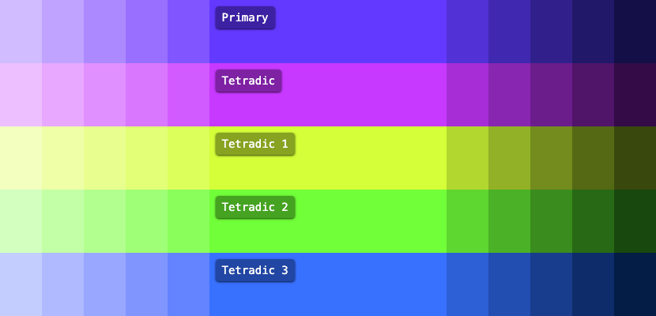

# AutoTheme

### One color in. Entire design system out.

```bash
npx autotheme --color "#6439FF" --harmony triadic
```

<!-- ASSET: hero-output-screenshot.png
     A single, wide screenshot showing the terminal output of the command above
     alongside the generated HTML preview — the palette swatches, the CSS variables,
     and a small themed UI component. Should feel like "one command did all of this." -->


---

[](./LICENSE)
[](https://github.com/damienbullis/autotheme/actions/workflows/ci.yml)


## Install

```bash
npm install autotheme
```

Or download a [standalone binary](https://github.com/damienbullis/autotheme/releases).

## What you get

From a single color, AutoTheme generates:

- **50–950 color scales** for every harmony color in OKLCH
- **Accessible text colors** — WCAG AAA (7:1) by default
- **Light & dark mode** with system preference detection
- **Tailwind v4** and **Shadcn UI** variables, ready to use
- Typography, spacing, gradients, and noise textures

```css
@import "./autotheme.css";
```

That's it. Your app is themed.

---

<details>
<summary><strong>I want a theme for my project</strong></summary>

Run one command. Get a CSS file.

```bash
autotheme --color "#6439FF" --harmony triadic
```

Import it:

```css
@import "./autotheme.css";
```

You now have a full color palette with light/dark mode, accessible text colors, typography, spacing, and gradients — all as CSS variables in OKLCH format.

</details>

<details>
<summary><strong>I want Tailwind v4 colors that just work</strong></summary>

```bash
autotheme --color "#FF6B35" --harmony analogous --tailwind
```

This generates Tailwind-compatible CSS with `@theme` directives. Use the colors like any Tailwind color:

```html
<div class="bg-primary-500 text-primary-foreground">
  Accessible by default.
</div>

<div class="bg-secondary-200 dark:bg-secondary-800">
  Dark mode included.
</div>
```

Every color gets a 50–950 scale, foreground, contrast, and tone variants.

</details>

<details>
<summary><strong>I want Shadcn UI colors that actually match</strong></summary>

AutoTheme generates all Shadcn UI semantic variables by default:

```bash
autotheme --color "#6439FF" --harmony split-complementary
```

The output includes `--background`, `--foreground`, `--primary`, `--secondary`, `--accent`, `--muted`, `--card`, `--destructive`, `--ring`, `--border`, and more — all derived from your harmony, all in OKLCH.

No manual color picking. No copy-pasting hex values from a design tool. The colors are mathematically related and visually consistent.

Don't need them? `--no-shadcn`.

</details>

<details>
<summary><strong>I want accessible colors without thinking about it</strong></summary>

Every color AutoTheme generates comes with a `foreground` variable — a text color that meets **WCAG AAA** (7:1 contrast ratio) against that background.

```css
/* These are guaranteed accessible together */
background: var(--color-primary-500);
color: var(--color-primary-foreground);
```

The default target is 7:1 (AAA). Lower it to 4.5:1 (AA) or anywhere from 3–21:

```json
{
  "contrastTarget": 4.5
}
```

AutoTheme tests black, white, and intermediate values against each color to find the best accessible foreground.

</details>

<details>
<summary><strong>I want dark mode that just works</strong></summary>

AutoTheme generates both light and dark schemes. Dark mode activates with `.dark` on your root element.

For automatic handling, add the dark mode script:

```bash
autotheme --color "#6439FF" --harmony triadic --dark-mode-script
```

```html
<head>
  <script src="/darkmode.js"></script>
</head>
```

This gives you:
- System preference detection (`prefers-color-scheme`)
- LocalStorage persistence across visits
- FOUC prevention (no flash of wrong theme)
- A global `toggleDarkMode()` function

</details>

<details>
<summary><strong>I want to preview the palette before committing</strong></summary>

```bash
autotheme --color "#6439FF" --harmony triadic --preview
```

This generates an HTML file showing every color swatch, the full scale, text contrast validation, and semantic color usage.


</details>

<details>
<summary><strong>I want to understand why these colors go together</strong></summary>

AutoTheme uses **color harmonies** — geometric relationships on the color wheel. Pick a harmony based on the feel you want:

| I want something...        | Use                     | Colors |
| -------------------------- | ----------------------- | ------ |
| Calm and cohesive          | `analogous`             | 3      |
| Bold and high contrast     | `complementary`         | 2      |
| Vibrant but balanced       | `triadic`               | 3      |
| Contrasty without clashing | `split-complementary`   | 3      |
| Rich and complex           | `square` or `rectangle` | 4      |
| Naturally pleasing         | `aurelian`              | 3      |
| Focused and decisive       | `bi-polar`              | 2      |
| Unique and unexpected      | `retrograde`            | 3      |
| Dynamic and mathematical   | `tetradic`              | 4      |

> All examples use `#6439FF`.





</details>

<details>
<summary><strong>I want fine-grained control</strong></summary>

### Config file

Create `autotheme.json` (or use `autotheme init`):

```json
{
  "$schema": "./node_modules/autotheme/schema.json",
  "color": "#6439FF",
  "harmony": "triadic",
  "tailwind": true,
  "preview": true,
  "contrastTarget": 7,
  "scalar": 1.618,
  "fontSize": 1
}
```

### CLI flags

```bash
autotheme \
  --color "#FF6B35" \
  --harmony split-complementary \
  --output ./styles/theme.css \
  --prefix brand \
  --tailwind \
  --preview \
  --dark-mode-script \
  --no-noise \
  --no-gradients
```

### Toggle features

| Flag              | Disables                      |
| ----------------- | ----------------------------- |
| `--no-shadcn`     | Shadcn UI semantic variables  |
| `--no-gradients`  | Gradient CSS variables        |
| `--no-spacing`    | Spacing scale                 |
| `--no-noise`      | Noise texture                 |
| `--no-utilities`  | Utility classes               |

Priority: CLI flags > config file > defaults.

### All config options

| Option           | Type      | Default                 | Description                    |
| ---------------- | --------- | ----------------------- | ------------------------------ |
| `color`          | `string`  | random                  | Primary color (hex, rgb, hsl)  |
| `harmony`        | `string`  | `"analogous"`           | Harmony type                   |
| `output`         | `string`  | `"./src/autotheme.css"` | Output path                    |
| `prefix`         | `string`  | `"color"`               | CSS variable prefix            |
| `fontSize`       | `number`  | `1`                     | Base font size (rem)           |
| `preview`        | `boolean` | `false`                 | HTML preview                   |
| `tailwind`       | `boolean` | `false`                 | Tailwind v4 CSS                |
| `darkModeScript` | `boolean` | `false`                 | Dark mode script               |
| `scalar`         | `number`  | `1.618`                 | Golden ratio multiplier        |
| `contrastTarget` | `number`  | `7`                     | Contrast ratio (3–21)          |
| `radius`         | `string`  | `"0.625rem"`            | Shadcn border radius           |
| `gradients`      | `boolean` | `true`                  | Gradient variables             |
| `spacing`        | `boolean` | `true`                  | Spacing scale                  |
| `noise`          | `boolean` | `true`                  | Noise texture                  |
| `shadcn`         | `boolean` | `true`                  | Shadcn UI variables            |
| `utilities`      | `boolean` | `true`                  | Utility classes                |

</details>

<details>
<summary><strong>I want to use it programmatically</strong></summary>

```typescript
import { Color, generateFullPalette, generateCSS } from "autotheme";

const primary = new Color("#6439FF");
const palette = generateFullPalette(primary, "triadic");

const theme = {
  palette,
  config: {
    color: "#6439FF",
    harmony: "triadic",
    output: "./autotheme.css",
    preview: false,
    tailwind: false,
    darkModeScript: false,
    scalar: 1.618,
    contrastTarget: 7,
    radius: "0.625rem",
    prefix: "color",
    fontSize: 1,
    gradients: true,
    spacing: true,
    noise: true,
    shadcn: true,
    utilities: true,
  },
};

const css = generateCSS(theme); // { filename, content }
```

Individual generators: `generateTailwindCSS()`, `generatePreview()`, `generateDarkModeScript()`.

</details>

---

## Learn more

- [How it works](docs/how-it-works.md) — Follow a color through the entire pipeline
- [Philosophy](docs/philosophy.md) — Why AutoTheme exists and the principles behind it
- [Architecture](docs/architecture.md) — Internal code structure for contributors

## I want to contribute

```bash
git clone https://github.com/damienbullis/autotheme.git && cd autotheme && bun install
bun run dev       # Watch mode
bun run test      # Tests
bun run check     # All checks (typecheck + lint + format + test)
```

## License

[MIT](./LICENSE)
