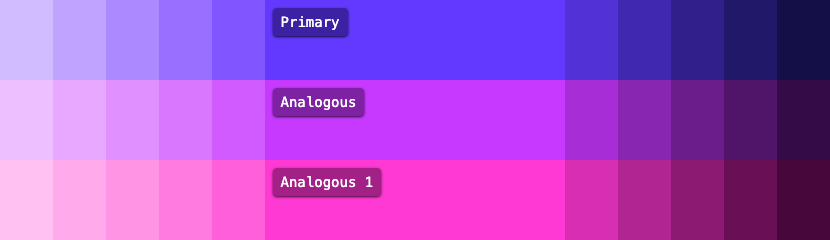
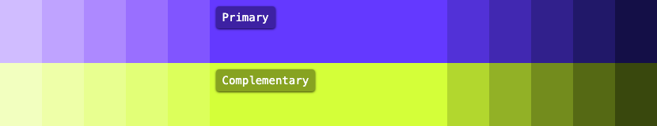
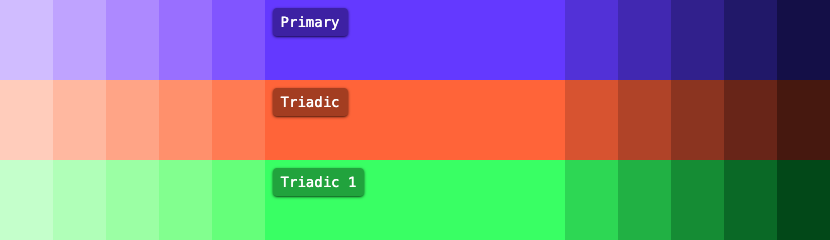
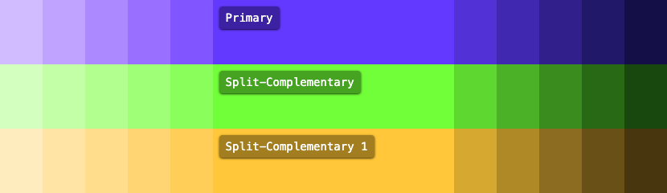
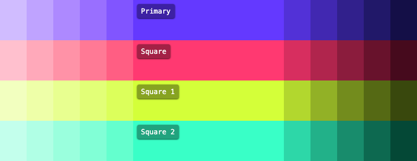
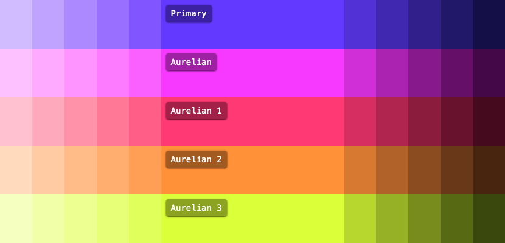
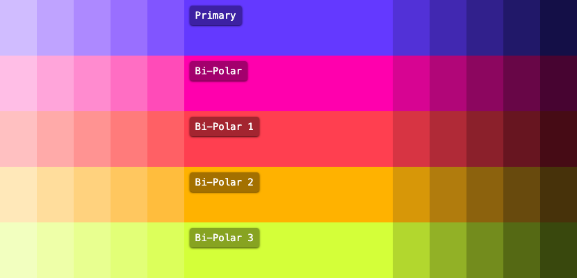
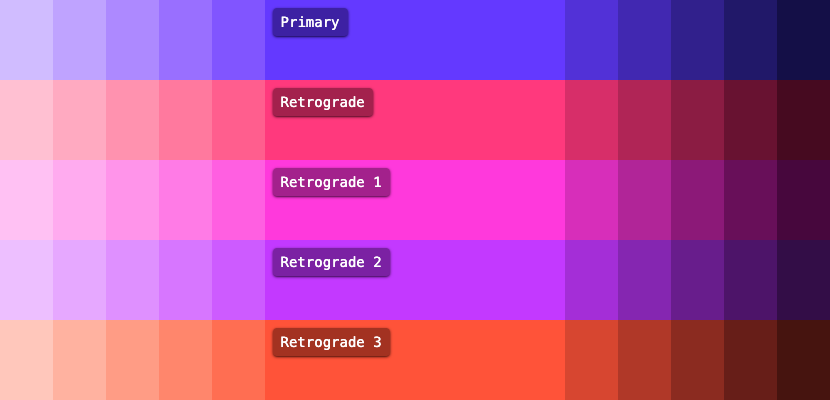
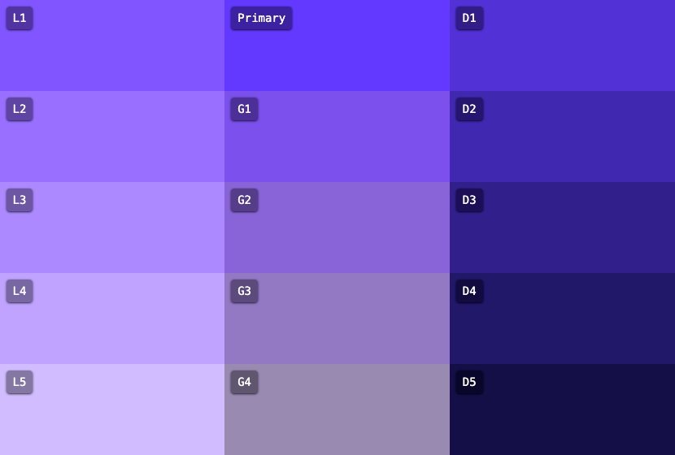
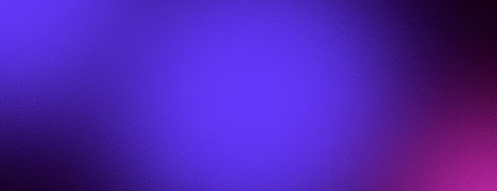

# AutoTheme

[](./LICENSE)
[](https://github.com/damienbullis/autotheme/actions/workflows/ci.yml)


> A zero-config, zero-dependency tool for generating accessible CSS themes using color theory.

AutoTheme generates color palettes from color harmonies and outputs CSS variables in OKLCH format, compatible with Tailwind v4 and Shadcn UI.

## Install

### npm / bun

```bash
npm install autotheme
# or
bun add autotheme
```

### Standalone Binary

Download from the [releases page](https://github.com/damienbullis/autotheme/releases), or use the install script:

```bash
curl -fsSL https://raw.githubusercontent.com/damienbullis/autotheme/main/install.sh | bash
```

## Quick Start

```bash
# Generate with defaults (random color, analogous harmony)
autotheme

# Specify color and harmony
autotheme --color "#6439FF" --harmony triadic

# Generate with Tailwind output and HTML preview
autotheme -c "#FF6B35" -a split-complementary --tailwind --preview

# Interactive config setup
autotheme init
```

Then include the generated CSS:

```html
<link rel="stylesheet" href="./src/autotheme.css" />
```

```css
@import "./autotheme.css";
```

## Harmonies

A harmony is a set of colors related by their position on the color wheel. Each harmony produces a different palette feel.

| Harmony                 | Colors | Description                                          |
| ----------------------- | ------ | ---------------------------------------------------- |
| **Analogous**           | 3      | Adjacent colors. Harmonious, serene.                 |
| **Complementary**       | 2      | Opposite colors. High contrast, vibrant.             |
| **Triadic**             | 3      | Equally spaced (120°). Balanced, vibrant.            |
| **Split-Complementary** | 3      | Base + two adjacent to its complement. Less tension. |
| **Piroku**              | 4      | Pi-based angular offset. Dynamic, intriguing.        |
| **Square**              | 4      | Equally spaced (90°). Bold, dynamic.                 |
| **Rectangle**           | 4      | Two complementary pairs. Versatile, balanced.        |
| **Aurelian**            | 3      | Golden angle (137.5°). Naturally harmonious.         |
| **Bi-Polar**            | 2      | Two dominant colors at 90°. Strong, focused.         |
| **Retrograde**          | 3      | Reverse triadic. Unique perspective.                 |

### Analogous



### Complementary



### Triadic



### Split-Complementary



### Piroku


### Square



### Rectangle


### Aurelian



### Bi-Polar



### Retrograde



> All examples use `#6439FF` to illustrate differences between harmonies.

## CSS Output

AutoTheme outputs CSS variables in **OKLCH** color format for perceptual uniformity, using **Tailwind v4** variable namespaces.

### Palette Structure



Each color in the harmony produces:

- **1 base** color (500)
- **5 tints** (50, 100, 200, 300, 400)
- **5 shades** (600, 700, 800, 900, 950)
- **4 tones** (tone-1, tone-2, tone-3, tone-4)
- **1 foreground** color (accessible text)
- **1 contrast** color (high contrast text)

### Color Scale

Colors are named by their role in the harmony (`primary`, `secondary`, `tertiary`, `quaternary`):

```css
--color-primary-50          /* Lightest tint */
--color-primary-100
--color-primary-200
--color-primary-300
--color-primary-400
--color-primary-500         /* Base color */
--color-primary-600
--color-primary-700
--color-primary-800
--color-primary-900
--color-primary-950         /* Darkest shade */
--color-primary-foreground  /* Accessible text color */
--color-primary-contrast    /* High contrast text */
--color-primary-tone-1..4   /* Desaturated variations */
```

The variable prefix defaults to `color` but can be changed with `--prefix`. When using Tailwind output with a custom prefix, `--color-*` aliases are automatically generated so utilities like `bg-primary-500` still work.

### Shadcn UI Variables

Full Shadcn UI semantic variables are included in OKLCH format: `--background`, `--foreground`, `--primary`, `--card`, `--destructive`, `--muted`, `--accent`, and more. Disable with `--no-shadcn`.

### Typography, Spacing, Gradients & Noise

```css
--text-xs..4xl           /* Typography scale (configurable base via fontSize) */
--spacing-1..10          /* Spacing scale */
--gradient-direction     /* Gradient direction */
--gradient-linear-*      /* Linear gradients to each harmony color */
--background-image-noise /* Noise texture SVG */
```



Each section can be individually disabled with `--no-spacing`, `--no-gradients`, `--no-noise`, or `--no-utilities`.

### Accessible Colors

AutoTheme targets **WCAG AAA** compliance by default with a **7:1 contrast ratio** for text colors. Each color in the palette gets a `foreground` color that meets the target contrast ratio against it. Adjust with the `contrastTarget` option (minimum 3 for WCAG AA, maximum 21).

## Dark Mode

AutoTheme generates both light and dark mode color schemes. Dark mode activates with the `.dark` class on the root element.

Use `--dark-mode-script` to generate a script that handles:

- System preference detection (`prefers-color-scheme: dark`)
- LocalStorage persistence
- FOUC prevention (include in `<head>`)
- Global `toggleDarkMode()` function

```html
<script src="/darkmode.js"></script>
```

## Configuration

AutoTheme can be configured with CLI flags, a config file, or both. Priority: CLI flags > config file > defaults.

### CLI Flags

| Flag                 | Short | Type     | Description                                       |
| -------------------- | ----- | -------- | ------------------------------------------------- |
| `--color`            | `-c`  | `string` | Primary color (hex, rgb, hsl)                     |
| `--harmony`          | `-a`  | `string` | Color harmony type                                |
| `--output`           | `-o`  | `string` | Output file path (default: `./src/autotheme.css`) |
| `--config`           |       | `string` | Path to config file                               |
| `--prefix`           |       | `string` | CSS variable prefix (default: `color`)            |
| `--font-size`        |       | `number` | Base font size in rem (default: `1`)              |
| `--preview`          |       | flag     | Generate HTML preview                             |
| `--tailwind`         |       | flag     | Generate Tailwind v4 CSS                          |
| `--dark-mode-script` |       | flag     | Generate dark mode script                         |
| `--no-gradients`     |       | flag     | Disable gradient variable generation              |
| `--no-spacing`       |       | flag     | Disable spacing scale generation                  |
| `--no-noise`         |       | flag     | Disable noise texture generation                  |
| `--no-shadcn`        |       | flag     | Disable Shadcn UI variable generation             |
| `--no-utilities`     |       | flag     | Disable utility class generation                  |
| `--silent`           | `-s`  | flag     | Suppress output                                   |

### Config File

AutoTheme looks for `autotheme.json`, `.autothemerc.json`, or `.autothemerc` in the current directory. Use `autotheme init` to create one interactively.

```json
{
  "$schema": "./node_modules/autotheme/schema.json",
  "color": "#6439FF",
  "harmony": "triadic"
}
```

All options and their defaults:

| Option           | Type      | Default                 | Description                                    |
| ---------------- | --------- | ----------------------- | ---------------------------------------------- |
| `color`          | `string`  | random                  | Primary color (hex, rgb, hsl)                  |
| `harmony`        | `string`  | `"analogous"`           | Color harmony type                             |
| `output`         | `string`  | `"./src/autotheme.css"` | Output file path                               |
| `prefix`         | `string`  | `"color"`               | CSS variable prefix (`--{prefix}-primary-500`) |
| `fontSize`       | `number`  | `1`                     | Base font size in rem for typography scale     |
| `preview`        | `boolean` | `false`                 | Generate HTML preview                          |
| `tailwind`       | `boolean` | `false`                 | Generate Tailwind v4 CSS                       |
| `darkModeScript` | `boolean` | `false`                 | Generate dark mode init script                 |
| `scalar`         | `number`  | `1.618`                 | Golden ratio multiplier for spacing/sizing     |
| `contrastTarget` | `number`  | `7`                     | Target contrast ratio (3-21)                   |
| `radius`         | `string`  | `"0.625rem"`            | Border radius for Shadcn components            |
| `gradients`      | `boolean` | `true`                  | Generate gradient CSS variables                |
| `spacing`        | `boolean` | `true`                  | Generate spacing scale                         |
| `noise`          | `boolean` | `true`                  | Generate noise texture variable                |
| `shadcn`         | `boolean` | `true`                  | Generate Shadcn UI compatible variables        |
| `utilities`      | `boolean` | `true`                  | Generate CSS utility classes                   |

## Module API

AutoTheme can be used as an importable module for programmatic theme generation:

```typescript
import { Color, generateFullPalette, generateCSS } from "autotheme";

const primary = new Color("#6439FF");
const palette = generateFullPalette(primary, "triadic");

const theme = {
  palette,
  config: {
    color: "#6439FF",
    harmony: "triadic",
    output: "./autotheme.css",
    preview: false,
    tailwind: false,
    darkModeScript: false,
    scalar: 1.618,
    contrastTarget: 7,
    radius: "0.625rem",
    prefix: "color",
    fontSize: 1,
    gradients: true,
    spacing: true,
    noise: true,
    shadcn: true,
    utilities: true,
  },
};

const css = generateCSS(theme); // { filename, content }
```

Individual generators are also available: `generateTailwindCSS()`, `generatePreview()`, `generateDarkModeScript()`.

## Development

```bash
git clone https://github.com/damienbullis/autotheme.git
cd autotheme
bun install
```

```bash
bun run dev           # Watch mode
bun run dev:web       # Web app dev server
bun run test          # Tests in watch mode
bun run test:run      # Tests once
bun run check         # All checks (typecheck + lint + format + test)
```

## License

[MIT](./LICENSE)
