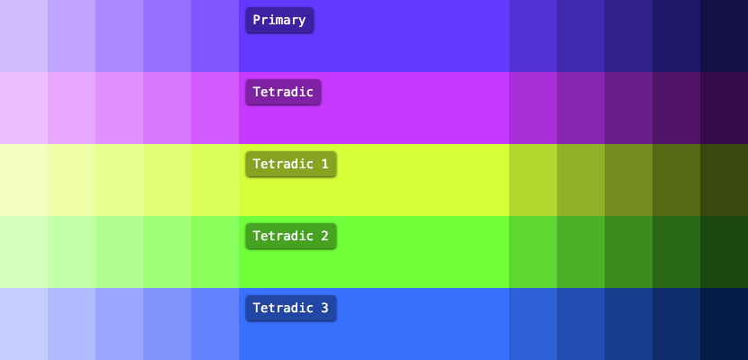
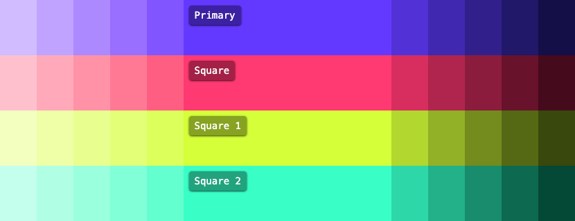
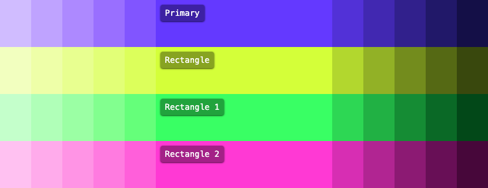
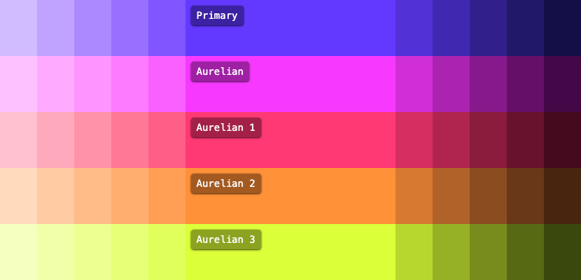
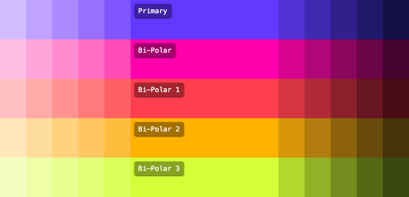
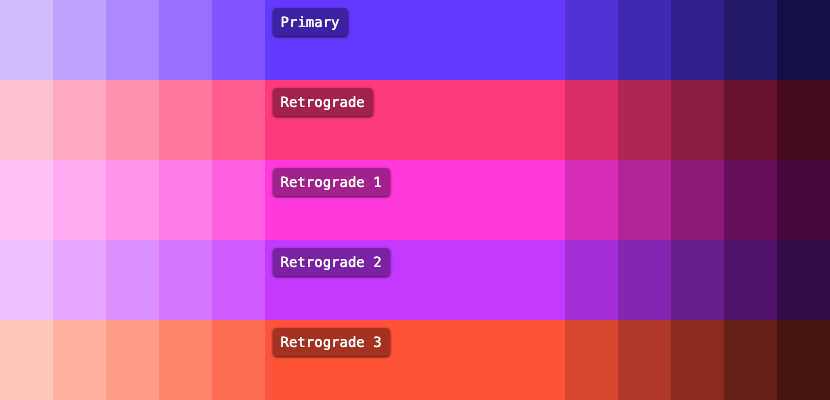

# AutoTheme


> A _`zero-config`_ & _`zero-dependency`_ tool for generating accessible CSS themes using color theory.

<details>
<summary><b>Contents</b></summary>

-   [Install](#install)
-   [Usage](#usage)
-   [Configuring](#configuring)
-   [CLI](#cli)
-   [Roadmap](#roapmap)

</details>

<br>

# Install

To install AutoTheme, you can use the following methods:

<details>
<summary style="font-size:1.1em; font-weight:bold;">Manual</summary>

#### Automatic Install (Recommended)

> `install.sh` will detect your system and download the appropriate binary.

<details>
<summary>For Linux/macOS (or Windows using Git Bash/WSL):</summary>

```bash
curl -sL https://raw.githubusercontent.com/username/repo/main/install.sh | bash
```

</details>

<details>
<summary>For Windows (PowerShell):</summary>

```powershell
Invoke-WebRequest -Uri "https://raw.githubusercontent.com/username/repo/main/install.ps1" -OutFile "install.ps1"; ./install.ps1
```

</details>

#### Manual Install

> Download the appropriate binary for your system from the [releases page](https://github.com/damienbullis/autotheme/releases).

</details>

<details>
<summary style="font-size:1.1em; font-weight:bold;">GO</summary>

```bash

```

</details>

<details>
<summary style="font-size:1.1em; font-weight:bold;">NPM</summary>

```bash

```

</details>

<br>

# Usage

```bash
autotheme
```

> By default AutoTheme will add a `src/index.css` to the current directory.

**AutoTheme will choose a random color and harmony for if none is provided.**

<br>

If you are planning on changing your theme often, or just want to make sure your theme stays consistent with any changes you make, you can add AutoTheme to your build process.

<details>
<summary style="font-weight:bold;">Manually add step to your build process.</summary>

#### Could be as simple as adding

```bash
&& autotheme <ARGS>
```

</details>

<details>

<summary style="font-weight:bold;">If you are using Vite.</summary>

See [AutoTheme Vite Plugin]() for more information.

##### TODO: Command to generate the plugin

</details>

</details>

<br>

## Configuration

AutoTheme can be configured using:

-   By passing flags to the CLI.
-   A `autotheme.yml` config file.

### `init` Command

```bash
# Interactive prompt
autotheme init

# Skip the interactive prompt
autotheme init -y
```

> By default `init` will create a `autotheme.yml` in the current directory.

<details>

<summary style="margin-bottom: 1em;">See Default Config</summary>

```yml
# autotheme.yml

color: "#FF0000"
harmony: "analogous"
scalar: 1.618
# Finish this section
```

</details>

<details>
<summary style="margin-bottom: 1em">CLI Flags</summary>

| Long        | Short | Type      | Description                                   |
| ----------- | ----- | --------- | --------------------------------------------- |
| `--color`   | `-c`  | `string`  | The primary color of the theme.               |
| `--harmony` | `-a`  | `string`  | The harmony of the theme. [See Harmonies](#)  |
| `--output`  | `-o`  | `string`  | The output file path.                         |
| `--config`  |       | `string`  | Path to your AutoTheme config file.           |
| `--preview` |       | `boolean` | Generate a preview.html to preview the theme. |
| `--silent`  | `-s`  | `boolean` | Suppress all output from AutoTheme.           |
| `--version` | `-v`  | `boolean` | Display version.                              |
| `--help`    | `-h`  | `boolean` | Display help.                                 |

</details>

### Harmonies

Using color theory to generate a color palette based on the primary color.

#### Examples

> We are using `#6439FF` for our examples to illustrate the differences of the harmonies.

<details>
<summary>Analogous</summary>
  
</details>

<details>
<summary>Complementary</summary>
  
</details>

<details>
<summary>Split Complementary</summary>
  
</details>

<details>
<summary>Triadic</summary>
  
</details>

<details>
<summary>Tetradic</summary>
  
</details>

<details>
<summary>Square</summary>
  
</details>

<details>
<summary>Rectangle</summary>
  
</details>

<details>
<summary>Lunar Eclipse</summary>
  
</details>

<details>
<summary>Aurelian</summary>
  
</details>

<details>
<summary>Bi Polar</summary>
  
</details>

<details>
<summary>Retrograde</summary>
  
</details>

## Dark Mode

Since there are a variety of setups for using dark mode, AutoTheme mostly provides the CSS variable framework. To finish integrating support for `prefers-color-scheme: dark`, there are a couple more steps.

<br>

1. On page load, so generally speaking your `index.html` should initialize dark-mode to prevent flashing unstyled content [FOUC](https://en.wikipedia.org/wiki/Flash_of_unstyled_content)

    - You can either inline the script tag directly

    ```html
    <script>
    	const darkMode = window.matchMedia("(prefers-color-scheme: dark)");
    	if (localStorage.getItem("darkMode") === "true" || darkMode.matches) {
    		document.documentElement.classList.add("at-dark");
    	}

    	// If the user's system changes the preferred color scheme
    	darkMode.addEventListener("change", (e) => {
    		if (e.matches) {
    			document.documentElement.classList.add("at-dark");
    		} else {
    			document.documentElement.classList.remove("at-dark");
    		}
    	});
    </script>
    ```

    - or load it as an external file `/darkmode.js` instead

    ```html
    <script src="/darkmode.js"></script>
    ```

    ```js
    // darkmode.js

    /**
     * Init Darkmode
     * - checks for dark mode preference
     * - applies `at-dark` class to the root element if dark mode is preferred
     * - handles OS color-scheme change events
     */
    function initializeDarkMode() {
    	const darkMode = window.matchMedia("(prefers-color-scheme: dark)");
    	if (localStorage.getItem("darkMode") === "true" || darkMode.matches) {
    		document.documentElement.classList.add("at-dark");
    	}

    	// This wont set the local storage on change, but it will update the class
    	darkMode.addEventListener("change", (e) => {
    		if (e.matches) {
    			document.documentElement.classList.add("at-dark");
    		} else {
    			document.documentElement.classList.remove("at-dark");
    		}
    	});
    }

    initializeDarkMode();
    ```

2. Setup your onClick handler

    ```js
    /**
     * Toggle Dark Mode
     * - applies `at-dark` class to the root element
     * - saves the state to local storage
     */
    function toggleDarkMode() {
    	const darkMode = document.documentElement.classList.toggle("at-dark");
    	localStorage.setItem("darkMode", darkMode.toString());
    }
    ```

<br>

Now your site is ready to support both `light` & `dark` color schemes based on user preferences! :tada:

<br>

## Roapmap

-   [ ] Core
    -   [ ] Add json schema for the config file
    -   [ ] Add Tests
-   [ ] Installers
    -   [x] bash cli install
    -   [ ] go install
    -   [ ] npm install
-   [ ] Plugins
    -   [ ] ~~Tailwind~~ I think this is just going to be integrated
    -   [ ] ~~Rollup/Vite~~ (On hold because of Rolldown announcement)
-   [x] Darkmode script snippet in README
-   [ ] index.html integration (entrypoint)
    -   [ ] include snippet in README
-   [ ] index.css integration (output)

<br>

---

---

---

<br>

## Development

### Setup

#### Clone repo

```bash
git clone https://github.com/damienbullis/autotheme.git
cd autotheme
```

#### Install dependencies

```bash
make install
```

<br>

See the [Makefile](./Makefile) for more commands.

<br>

### Testing

#### All tests

```bash
make test
```

#### Watch mode

```bash
make test-watch
```

<br>

## Releasing

Releases are created via the `Release` workflow.

To create a new release, manually trigger the release workflow by going to the actions tab in the repo and selecting the `Release` workflow.

Enter the new version number when prompted and the workflow will take care of the rest.

-   [ ] Add on tag push trigger to the release workflow.

### Tagging Commits

Start your commit message with one of the following prefixes if you want to tag your commits in the changelog:

-   `feat - <YOUR_MESSAGE>` for new features
-   `fix - <YOUR_MESSAGE>` for bug fixes
-   `chore - <YOUR_MESSAGE>` for basically everything else
