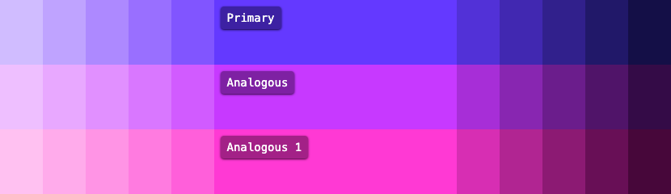
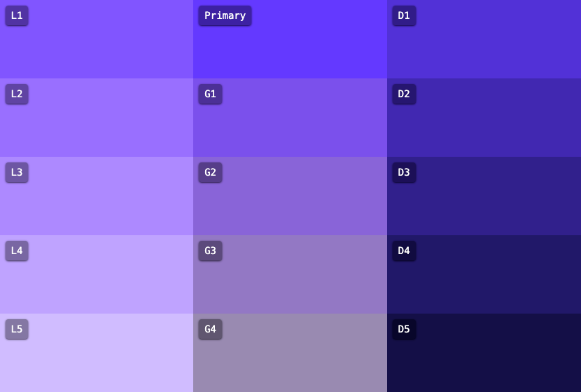

# AutoTheme


> A _`zero-config`_ & _`zero-dependency`_ tool for generating accessible CSS themes using color theory.

<!--
<details>
<summary><b>Contents</b></summary>

-   [Install](#install)
-   [Usage](#usage)
-   [Configuring](#configuring)
-   [CLI](#cli)
-   [Roadmap](#roapmap)

</details> -->

# Install

To install AutoTheme, you can use the following methods:

<details>
<summary style="font-size:1.1em; font-weight:bold;">Manual</summary>

#### Automatic Install (Recommended)

> `install.sh` will detect your system and download the appropriate binary.

<details>
<summary>For Linux/macOS (or Windows using Git Bash/WSL):</summary>

```bash
curl -sL https://raw.githubusercontent.com/username/repo/main/install.sh | bash
```

</details>

<details>
<summary>For Windows (PowerShell):</summary>

```powershell
Invoke-WebRequest -Uri "https://raw.githubusercontent.com/username/repo/main/install.ps1" -OutFile "install.ps1"; ./install.ps1
```

</details>

#### Manual Install

> Download the appropriate binary for your system from the [releases page](https://github.com/damienbullis/autotheme/releases).

</details>

<details>
<summary style="font-size:1.1em; font-weight:bold;">GO</summary>

```bash

```

</details>

<details>
<summary style="font-size:1.1em; font-weight:bold;">NPM</summary>

```bash

```

</details>

<br>

# Usage

To generate your theme, run the following command in your terminal.

```bash
autotheme
```

> By default AutoTheme will output to `src/autotheme.css` using a random color and harmony.

```bash
autotheme --color="#FF0000" --harmony="analogous"
```

### Including your theme

<details>
<summary>Using HTML</summary>

> Include the generated CSS file in your HTML.

```html
<link rel="stylesheet" href="./src/autotheme.css" />
```

</details>

<details>
<summary>Using CSS</summary>

> Include the generated CSS file in your main.

```css
@import "./autotheme.css";
```

</details>

<details>
<summary>Using A Framework</summary>

> If you are using a framework like React, Vue, or Angular, you can include the CSS file in your main component.

```js
import "./src/index.css";
```

</details>

### Keeping your theme consistent

If you are planning on changing your theme often, or just want to make sure your theme stays up-to-date with any changes you make.
You can add AutoTheme to your build process.

<details>
<summary>Manually add step to your build process.</summary>

> Could be as simple as adding

```bash
&& autotheme <ARGS>
```

</details>

<details>
<summary>If you are using Vite.</summary>

> See [AutoTheme Vite Plugin]() for more information.

-   [ ] Command to generate the plugin

</details>

</details>

## Configuration

AutoTheme can be configured using:

<details>
<summary>CLI Flags</summary>

<br>

| Long        | Short | Type      | Description                                                            |
| ----------- | ----- | --------- | ---------------------------------------------------------------------- |
| `--color`   | `-c`  | `string`  | The primary color of the theme.                                        |
| `--harmony` | `-a`  | `string`  | The harmony of the theme. See [Harmonies] for accepted harmony values. |
| `--output`  | `-o`  | `string`  | The output file path. (default=./src/autotheme.css)                    |
| `--config`  |       | `string`  | Path to your AutoTheme config file. (default=./autotheme.yml)          |
| `--preview` |       | `boolean` | Generate a preview.html to preview the theme.                          |
| `--silent`  | `-s`  | `boolean` | Suppress all output from AutoTheme.                                    |
| `--version` | `-v`  | `boolean` | Display version.                                                       |
| `--help`    | `-h`  | `boolean` | Display help.                                                          |

</details>

<details>
<summary>A config file</summary>

```yml
# autotheme.yml

color: "#FF0000"
harmony: "analogous"
scalar: 1.618
# Finish this section
```

> [Full Config](docs/autotheme.config.yml)

</details>

### Using `init`

```bash
# Interactive prompt
autotheme init

# Skip the interactive prompt
autotheme init -y
```

> By default `init` will create a `autotheme.yml` in the current directory.

## Accessible Colors

> AutoTheme aims to be WCAG 2.1 AAA compliant by default. (See [Understanding Contrast (WCAG)](https://www.w3.org/WAI/WCAG21/Understanding/contrast-enhanced.html))

AutoTheme generates a `--at-bkgd` background color for light & dark modes.

Contrast ratios for each text color are calculated against the appropriate background color.
_If the contrast ratio is below 7:1, it will adjust the color until it meets the criteria._

#### \*NOTE\* If you are using a different background color, accessibility may vary.

<picture>
  <source media="(prefers-color-scheme: dark)" srcset="./docs/assets/text-dark.png">
  
</picture>

## Harmonies

> A set of colors related to each other.

Set your harmony using the `--harmony` or `-a` flag or the `harmony` option in the config file.

#### Analogous



<details>
<summary>See All Harmonies</summary>

#### Split-Complementary


#### Complementary


#### Triadic


#### Tetradic


#### Square


#### Rectangle


<!-- #### Lunar Eclipse -->

<!--  -->

#### Aurelian


#### Bi Polar


#### Retrograde


<br>

> All examples are using `#6439FF` to illustrate the differences in harmonies.

</details>

### Full Color Palette

> In addition to the Harmony, each color has a set of tints, shades, and tones. And each of those colors has a set of accessible text colors. [See Accessible Colors](#accessible-colors)

<details>



Each color in the Harmony consists of:

-   **1 primary** color
-   **5 tints** (L1, ..., L5)
-   **5 shades** (D1, ..., D5)
-   **4 tones** (G1, ..., G4)

</details>

<br>

# Features

Let's look at some advanced features to create modern and unique themes.

## Gradients

> Gradients are a great way to add depth to your site.


<details>
<summary>Using TailwindCSS (Recommended)</summary>

> AutoTheme intregrates directly with Tailwind's linear gradients, and extends it with radial gradients.

### Linear Gradients

```html
<div class="bg-gradient-to-br from-primary to-hamony-b"></div>
```

### Radial Gradients

```html
<div class="bg-radial from-harmony-a"></div>
```

Tailwind doesn't have built-in support for radial gradients, so AutoTheme adds some utility classes to your tailwind config.

-   `radial-position` - sets the position of the gradient (default: '50% 50%')
-   `radial-scale` - sets the scale of the gradient (default: '100% 100%')

```html
<div class="radial-scale-100 radial-position-0-0 bg-radial"></div>
<!-- Or using arbitrary values -->
<div class="radial-scale-[10%_90%] radial-position-[0px_150px] bg-radial"></div>
```

</details>

<details>
<summary>Basic Usage</summary>

> AutoTheme provides a some simple utility css classes for creating gradients.

### Linear Gradients

> Lets take a look a the `at-linear` class.

```html
<div class="at-linear"></div>
```

```css
:root {
	/* default gradient  */
	--at-direction: to right;
	--at-from: rgb(var(--at-c0) / var(--at-opacity));
	--at-from-position: -20%;
	--at-to: transparent;
	--at-to-position: 120%;
}

.at-linear {
	--at-stops: var(--at-from) var(--at-from-position), var(--at-to) var(--at-to-position);
	background-image: linear-gradient(var(--at-direction), var(--at-stops));
}
```

<details>
<summary>Why are utility classes needed?</summary>

You may have noticed that `.at-linear` and `.at-radial` are the only classes that AutoTheme provides.

That is because if we were to try and use a variable for the gradient (let's say `var(--at-linear)`).

```html
<div style="--at-from: rgb(var(--at-c4)); background: var(--at-linear);"></div>
```

##### Notice that the new color is not applied.

> This is because the variable has already been defined _before_ we set the new color.

</details>

### Customizing Gradients

> You can also customize gradients inline using the `style` attribute.

<!-- prettier-ignore -->
```html
<div
	class="at-linear"
	style="--at-direction: to bottom; --at-from: var(--at-c1); --at-to: var(--at-c3);"
></div>
```

> Or by creating a new class.

1. Add a new class to pair with the `at-linear` class that defines the gradient properties.

    ```css
    .your-gradient {
    	--at-direction: 45deg;
    	--at-from: var(--at-c1);
    	--at-from-position: 0%;
    	--at-to: var(--at-c3);
    	--at-to-position: 100%;
    }
    ```

2. Add both classes to your element.

    ```html
    <div class="your-gradient at-linear"></div>
    ```

    > **IMPORTANT:** The `your-gradient` class must be defined before the `at-linear` class.

#### Radial Gradients

> Radial gradients are customized in the same way except for using the `scale` and `position` variables.

```css
.at-radial {
	--at-stops: var(--at-from) var(--at-from-position), var(--at-to) var(--at-to-position);
	background-image: radial-gradient(var(--at-scale) at var(--at-position), var(--at-stops));
}
```

</details>

## Noise

> Noise is a great way to add texture to your site.

  

### Usage

Include the `--at-noise` variable in your CSS. Or if you are using TailwindCSS, you can use the `at-noise` class.

```css
.element {
	/* Basic Usage */
	background-image: var(--at-noise);
}
```

### Combining Features

> Combine noise with gradients and blend modes to create unique effects.

```css
.element {
	/* Advanced Usage */
	background-image: var(--at-noise) linear-gradient(
			var(--at-direction),
			var(--at-c1),
			var(--at-c2)
		);
	background-blend-mode: overlay screen;
}
```

<br>

## Dark Mode

To finish integrating support for `prefers-color-scheme: dark`, there are a couple more steps.

<details>

<br>

1. On page load, so generally speaking your `index.html` should initialize dark-mode to prevent flashing unstyled content [FOUC](https://en.wikipedia.org/wiki/Flash_of_unstyled_content)

    - You can either inline the script tag directly

    ```html
    <script>
    	const darkMode = window.matchMedia("(prefers-color-scheme: dark)");
    	if (localStorage.getItem("darkMode") === "true" || darkMode.matches) {
    		document.documentElement.classList.add("at-dark");
    	}

    	// If the user's system changes the preferred color scheme
    	darkMode.addEventListener("change", (e) => {
    		if (e.matches) {
    			document.documentElement.classList.add("at-dark");
    		} else {
    			document.documentElement.classList.remove("at-dark");
    		}
    	});
    </script>
    ```

    - or load it as an external file `/darkmode.js` instead

    ```html
    <script src="/darkmode.js"></script>
    ```

    ```js
    // darkmode.js

    /**
     * Init Darkmode
     * - checks for dark mode preference
     * - applies `at-dark` class to the root element if dark mode is preferred
     * - handles OS color-scheme change events
     */
    function initializeDarkMode() {
    	const darkMode = window.matchMedia("(prefers-color-scheme: dark)");
    	if (localStorage.getItem("darkMode") === "true" || darkMode.matches) {
    		document.documentElement.classList.add("at-dark");
    	}

    	// This wont set the local storage on change, but it will update the class
    	darkMode.addEventListener("change", (e) => {
    		if (e.matches) {
    			document.documentElement.classList.add("at-dark");
    		} else {
    			document.documentElement.classList.remove("at-dark");
    		}
    	});
    }

    initializeDarkMode();
    ```

2. Setup your onClick handler

    ```js
    /**
     * Toggle Dark Mode
     * - applies `at-dark` class to the root element
     * - saves the state to local storage
     */
    function toggleDarkMode() {
    	const darkMode = document.documentElement.classList.toggle("at-dark");
    	localStorage.setItem("darkMode", darkMode.toString());
    }
    ```

<br>

-   [ ] Add command to CLI for generating the dark mode script.

Now your site is ready to support both `light` & `dark` color schemes based on user preferences! :tada:

</details>

## Development

<details>

### Setup

#### Clone repo

```bash
git clone https://github.com/damienbullis/autotheme.git
cd autotheme
```

#### Install dependencies

```bash
make install
```

<br>

See the [Makefile](./Makefile) for more commands.

<br>

### Testing

#### All tests

```bash
make test
```

#### Watch mode

```bash
make test-watch
```

</details>

## Releasing

<details>

Releases are created via the `Release` workflow.

To create a new release, manually trigger the release workflow by going to the actions tab in the repo and selecting the `Release` workflow.

Enter the new version number when prompted and the workflow will take care of the rest.

-   [ ] Add on tag push trigger to the release workflow.

### Tagging Commits

Start your commit message with one of the following prefixes if you want to tag your commits in the changelog:

-   `feat - <YOUR_MESSAGE>` for new features
-   `fix - <YOUR_MESSAGE>` for bug fixes
-   `chore - <YOUR_MESSAGE>` for basically everything else

</details>
